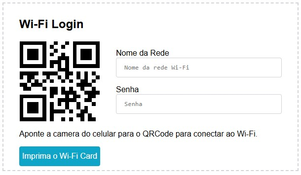

# Gerador de QR Code de conexão Wi-FI

## O Projeto
Este projeto utiliza HTML, CSS e JavaScript para gerar um QR Code que facilita a conexão a uma rede Wi-Fi, usando as informações de SSID e senha. Além de exibir o QR Code, o projeto também apresenta esses dados de forma clara, para que os usuários que não consigam escanear o código possam se conectar manualmente. 
Há ainda um botão que permite imprimir o card completo, incluindo o QR Code e as informações da rede.

### Dinâmico
Por ser dinâmico, o QR Code é atualizado automaticamente conforme os dados são inseridos, sem a necessidade de recarregar a página ao final da digitação.

### Agilidade
Com apenas duas informações necessárias, a geração do QR Code é rápida e eficiente, permitindo a criação de múltiplas imagens e impressões com agilidade.

### Imagem do Projeto
